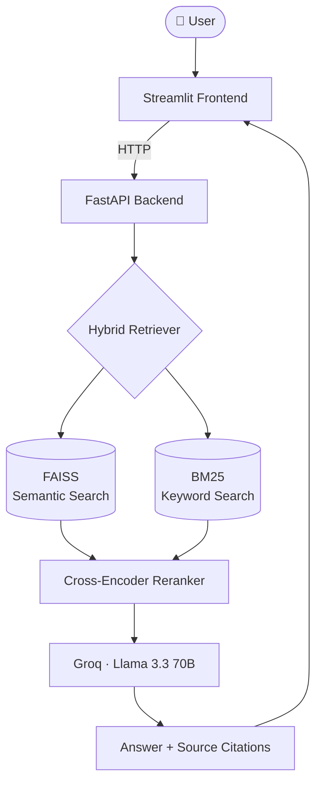
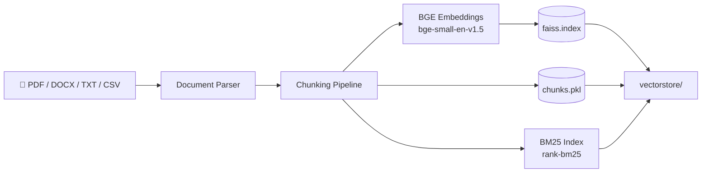

# 🔍 Enterprise RAG Platform

A Retrieval-Augmented Generation (RAG) system for document question-answering — combining hybrid search, cross-encoder reranking, and a measured evaluation framework. Built to avoid the most common RAG failure mode: **shipping retrieval that feels good without proving it.**

[](https://www.python.org/)
[](https://fastapi.tiangolo.com/)
[](https://streamlit.io/)
[](https://github.com/facebookresearch/faiss)
[](https://groq.com/)

## Table of Contents
- [Overview](#overview)
- [Key Results](#key-results)
- [Architecture](#architecture)
- [Features](#features)
- [Tech Stack](#tech-stack)
- [Project Structure](#project-structure)
- [Getting Started](#getting-started)
- [Evaluation Methodology](#evaluation-methodology)
- [Roadmap](#roadmap)
- [Contributing](#contributing)
- [License](#license)

## Overview

Traditional LLMs only know what they were trained on — they can't answer questions about a user's own documents. This project solves that by ingesting documents, retrieving the most relevant sections, and generating answers grounded in — and cited to — the source material, reducing hallucination.

## Key Results

| Metric | Hybrid Retrieval (FAISS + BM25) | + Cross-Encoder Reranking |
|---|---|---|
| Hit Rate@5 | 100% | 100% |
| MRR | 0.383 | **0.417** (+8.7%) |

Retrieval coverage was already strong — the correct chunk was found for every test question. Reranking improved *where* that chunk was ranked, which is what actually drives downstream answer quality.

Full methodology and scripts are in [`evaluation/`](evaluation/). Evaluated on a hand-labeled test set — see [`evaluation/test_questions.py`](evaluation/test_questions.py). _(Fill in your exact question count here once finalized.)_

## Architecture

**Query-time flow** — what happens when a user asks a question:



**Ingestion pipeline** — what happens when a document is uploaded:



> Both diagrams are written in [Mermaid](https://mermaid.js.org/), which GitHub renders natively — no extra setup needed.

## Features

#### 📥 Ingestion
- Multi-document upload (PDF, DOCX, TXT, CSV)
- Chunking pipeline for retrieval-optimized text segments

#### 🔎 Retrieval
- Semantic search via `BAAI/bge-small-en-v1.5` embeddings (Sentence Transformers)
- Persistent FAISS vector store
- BM25 keyword retrieval for exact-match terms (names, certifications, IDs, etc.)
- Hybrid retrieval combining semantic + keyword search
- Cross-encoder reranking (`cross-encoder/ms-marco-MiniLM-L-6-v2`)

#### 🧠 Generation
- Source-grounded citations on every answer
- Powered by Groq · Llama 3.3 70B for fast inference

#### 📊 Evaluation
- Retrieval evaluation framework (Hit Rate@5, MRR) comparing retrieval strategies head-to-head

#### 🖥️ Interfaces
- FastAPI backend with auto-generated Swagger docs
- Streamlit frontend for upload, querying, and source display

## Tech Stack

| Category | Tools |
|---|---|
| AI / ML | Sentence Transformers, BGE embeddings, Hugging Face, Cross-Encoder reranker, Groq (Llama 3.3 70B) |
| Retrieval | FAISS, BM25 (`rank-bm25`) |
| Backend | FastAPI, Uvicorn |
| Frontend | Streamlit |
| Data Processing | Pandas, PyPDF, python-docx |

## Project Structure

```text
enterprise-rag-platform/
├── backend/
│   └── src/
│       ├── api/
│       ├── embeddings/
│       ├── ingestion/
│       ├── llm/
│       ├── retrieval/
│       └── utils/
├── frontend/
│   └── app.py
├── evaluation/
│   ├── test_questions.py
│   ├── evaluate.py
│   ├── mrr.py
│   └── reranker_eval.py
├── data/
├── vectorstore/
│   ├── faiss.index
│   └── chunks.pkl
├── tests/
├── notebooks/
├── requirements.txt
└── .env.example
```

## Getting Started

### 1. Clone the repository
```bash
git clone https://github.com/<your-username>/enterprise-rag-platform.git
cd enterprise-rag-platform
```

### 2. Set up a virtual environment
```bash
python -m venv venv
source venv/bin/activate   # Windows: venv\Scripts\activate
pip install -r requirements.txt
```

### 3. Configure environment variables
Create a `.env` file in the project root:
```env
GROQ_API_KEY=your_key_here
```

### 4. Run the backend
```bash
uvicorn backend.src.api.main:app --reload
```
Swagger docs: [http://127.0.0.1:8000/docs](http://127.0.0.1:8000/docs)

### 5. Run the frontend
```bash
streamlit run frontend/app.py
```

## Evaluation Methodology

Retrieval quality was measured against a hand-labeled test set mapping questions to their expected source chunk:

- **Hit Rate@5** — whether the correct chunk appears anywhere in the top 5 retrieved results.
- **MRR (Mean Reciprocal Rank)** — how high the correct chunk is ranked, not just whether it's present.

Both metrics were computed for hybrid retrieval alone, then again after cross-encoder reranking, to isolate the reranker's actual contribution rather than assume it helped.

## Roadmap

- [ ] Expand evaluation set with paraphrased / keyword-mismatched questions to stress-test retrieval further
- [ ] Live deployment with public demo link
- [ ] Containerize with Docker
- [ ] Swap FAISS for a managed vector store (e.g. pgvector, Pinecone) for multi-user scale

## Contributing

Contributions, issues, and feature requests are welcome. Feel free to check the [issues page](../../issues) or open a pull request.
